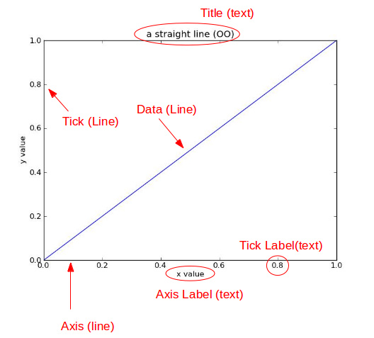
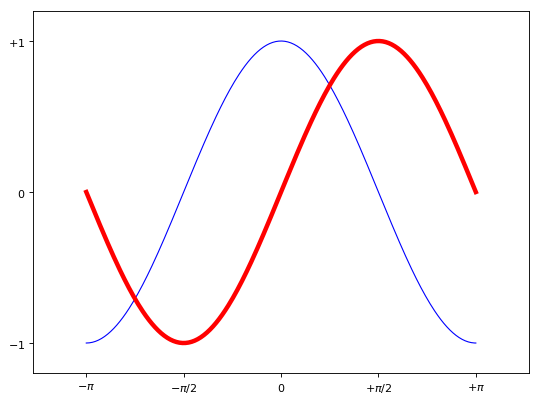
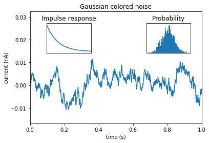

# Python--matplotlib绘图可视化知识点整理

转载于：[Python--matplotlib绘图可视化知识点整理](https://segmentfault.com/a/1190000005104723)

## 设置matplotlib参数
在代码执行过程中，有两种方式更改参数：

- 使用参数字典(`rcParams`)
- 调用`matplotlib.rc()`命令，通过传入关键字元祖，修改参数

如果不想每次使用matplotlib时都在代码部分进行配置，可以修改matplotlib的文件参数。可以用如下命令来找到当前用户的配置文件目录。


```python
import matplotlib  
matplotlib.get_data_path()
```


    'x:\\software\\python3.6\\lib\\site-packages\\matplotlib\\mpl-data'


得到配置文件夹，其中有font文件夹。

配置文件包括以下配置项：

- axex: 设置坐标轴边界和表面的颜色、坐标刻度值大小和网格的显示
- backend: 设置目标暑促TkAgg和GTKAgg
- figure: 控制dpi、边界颜色、图形大小、和子区( subplot)设置
- font: 字体集（font family）、字体大小和样式设置
- grid: 设置网格颜色和线性
- legend: 设置图例和其中的文本的显示
- line: 设置线条（颜色、线型、宽度等）和标记
- patch: 是填充2D空间的图形对象，如多边形和圆。控制线宽、颜色和抗锯齿设置等。
- savefig: 可以对保存的图形进行单独设置。例如，设置渲染的文件的背景为白色。
- verbose: 设置matplotlib在执行期间信息输出，如silent、helpful、debug和debug-annoying。
- xticks和yticks: 为x,y轴的主刻度和次刻度设置颜色、大小、方向，以及标签大小。

## 线条相关属性标记设置
### 线条的属性
<table>
<thead><tr>
<th>线条风格linestyle或ls</th>
<th>描述</th>
</tr></thead>
<tbody>
<tr>
<td>'-'</td>
<td>实线</td>
</tr>
<tr>
<td>':'</td>
<td>虚线</td>
</tr>
<tr>
<td>'--'</td>
<td>破折线</td>
</tr>
<tr>
<td>'None',' ',''</td>
<td>什么都不画</td>
</tr>
<tr>
<td>'-.'</td>
<td>点划线</td>
</tr>
</tbody>
</table>

### 线条标记
<table>
<thead><tr>
<th>标记</th>
<th>描述</th>
<th>标记</th>
<th colspan="2">描述</th>
</tr></thead>
<tbody>
<tr>
<td>'o'</td>
<td>圆圈</td>
<td>'.'</td>
<td>点</td>
</tr>
<tr>
<td>'D'</td>
<td>菱形</td>
<td>'s'</td>
<td>正方形</td>
</tr>
<tr>
<td>'h'</td>
<td>六边形1</td>
<td>'*'</td>
<td>星号</td>
</tr>
<tr>
<td>'H'</td>
<td>六边形2</td>
<td>'d'</td>
<td>小菱形</td>
</tr>
<tr>
<td>'_'</td>
<td>水平线</td>
<td>'v'</td>
<td>一角朝下的三角形</td>
</tr>
<tr>
<td>'8'</td>
<td>八边形</td>
<td>'&lt;'</td>
<td>一角朝左的三角形</td>
</tr>
<tr>
<td>'p'</td>
<td>五边形</td>
<td>'&gt;'</td>
<td>一角朝右的三角形</td>
</tr>
<tr>
<td>','</td>
<td>像素</td>
<td>'^'</td>
<td>一角朝上的三角形</td>
</tr>
<tr>
<td>'+'</td>
<td>加号</td>
<td>'\'</td>
<td>竖线</td>
</tr>
<tr>
<td>'None','',' '</td>
<td>无</td>
<td>'x'</td>
<td>X</td>
</tr>
</tbody>
</table>

### 颜色
可以通过调用`matplotlib.pyplot.colors()`得到matplotlib支持的所有颜色。

<table>
<thead><tr>
<th>别名</th>
<th>颜色</th>
<th>别名</th>
<th colspan="2">颜色</th>
</tr></thead>
<tbody>
<tr>
<td>b</td>
<td>蓝色</td>
<td>g</td>
<td>绿色</td>
</tr>
<tr>
<td>r</td>
<td>红色</td>
<td>y</td>
<td>黄色</td>
</tr>
<tr>
<td>c</td>
<td>青色</td>
<td>k</td>
<td colspan="2">黑色</td>
</tr>
<tr>
<td>m</td>
<td>洋红色</td>
<td>w</td>
<td>白色</td>
</tr>
</tbody>
</table>

如果这两种颜色不够用，还可以通过两种其他方式来定义颜色值：

- 使用HTML十六进制字符串`color='eeefff'`使用合法的HTML颜色名字（'red','chartreuse'等）。
- 也可以传入一个归一化到`[0,1]`的RGB元祖： `color=(0.3,0.3,0.4)`

### 背景色
通过向如`matplotlib.pyplot.axes()`或者`matplotlib.pyplot.subplot()`这样的方法提供一个`axisbg`参数，可以指定坐标这的背景色。
```python
subplot(111,axisbg=(0.1843,0.3098,0.3098)
```

## 基础
如果你向`plot()`指令提供了一维的数组或列表，那么matplotlib将默认它是一系列的y值，并自动为你生成x的值。默认的x向量从0开始并且具有和y同样的长度。



## 确定坐标范围
- `plt.axis([xmin, xmax, ymin, ymax])`上面例子里的axis()命令给定了坐标范围。
- `xlim(xmin, xmax)`和`ylim(ymin, ymax)`来调整x,y坐标范围


```python
import numpy as np
import matplotlib.pyplot as plt

%matplotlib inline

x = np.arange(-5.0, 5.0, 0.02)
y1 = np.sin(x)

plt.figure(1)
plt.subplot(211)
plt.plot(x, y1)

plt.subplot(212)
#设置x轴范围
plt.xlim(-2.5, 2.5)
#设置y轴范围
plt.ylim(-1, 1)
plt.plot(x, y1)

plt.show()
```


## 叠加图
用一条指令画多条不同格式的线。


```python
import numpy as np
import matplotlib.pyplot as plt

# evenly sampled time at 200ms intervals
t = np.arange(0., 5., 0.2)

# red dashes, blue squares and green triangles
plt.plot(t, t, 'r--', t, t**2, 'bs', t, t**3, 'g^')
plt.show()
```


## plt.text()添加文字说明

- `text()`可以在图中的任意位置添加文字，并支持LaTex语法
- `xlable()`, `ylable()`用于添加x轴和y轴标签
- `title()`用于添加图的题目


```python
import numpy as np
import matplotlib.pyplot as plt

mu, sigma = 100, 15
x = mu + sigma * np.random.randn(10000)

# 数据的直方图
n, bins, patches = plt.hist(x, 50, density=1, facecolor='g', alpha=0.75)


plt.xlabel('Smarts')
plt.ylabel('Probability')
#添加标题
plt.title('Histogram of IQ')
#添加文字
plt.text(60, .025, r'$\mu=100,\ \sigma=15$')
plt.axis([40, 160, 0, 0.03])
plt.grid(True)
plt.show()
```


## plt.annotate()文本注释

在数据可视化的过程中，图片中的文字经常被用来注释图中的一些特征。使用`annotate()`方法可以很方便地添加此类注释。在使用annotate时，要考虑两个点的坐标：被注释的地方`xy=(x, y)`和插入文本的地方`xytext=(x, y)`。


```python
import numpy as np
import matplotlib.pyplot as plt

ax = plt.subplot(111)

t = np.arange(0.0, 5.0, 0.01)
s = np.cos(2*np.pi*t)
line, = plt.plot(t, s, lw=2)

plt.annotate('local max', xy=(2, 1), xytext=(3, 1.5),arrowprops=dict(facecolor='black', shrink=0.05),)

plt.ylim(-2,2)
plt.show()
```


## plt.xticks()/plt.yticks()设置轴记号

设置坐标轴的刻度显示的值。


```python
import numpy as np
import matplotlib.pyplot as plt

# 创建一个 8 * 6 点（point）的图，并设置分辨率为 80
plt.figure(figsize=(8,6), dpi=80)

# 创建一个新的 1 * 1 的子图，接下来的图样绘制在其中的第 1 块（也是唯一的一块）
plt.subplot(1,1,1)

X = np.linspace(-np.pi, np.pi, 256,endpoint=True)
C,S = np.cos(X), np.sin(X)

# 绘制余弦曲线，使用蓝色的、连续的、宽度为 1 （像素）的线条
plt.plot(X, C, color="blue", linewidth=1.0, linestyle="-")
# 绘制正弦曲线，使用绿色的、连续的、宽度为 1 （像素）的线条
plt.plot(X, S, color="r", lw=4.0, linestyle="-")

plt.axis([-4,4,-1.2,1.2])

# 设置轴记号
plt.xticks([-np.pi, -np.pi/2, 0, np.pi/2, np.pi],[r'$-\pi$', r'$-\pi/2$', r'$0$', r'$+\pi/2$', r'$+\pi$'])
plt.yticks([-1, 0, +1],[r'$-1$', r'$0$', r'$+1$'])

# 在屏幕上显示
plt.show()
```





## 移动脊柱 坐标系

```python
ax = plt.gca()
ax.spines['right'].set_color('none')
ax.spines['top'].set_color('none')
ax.xaxis.set_ticks_position('bottom')
ax.spines['bottom'].set_position(('data',0))
ax.yaxis.set_ticks_position('left')
ax.spines['left'].set_position(('data',0))
```

## plt.legend()添加图例


```python
plt.plot(X, C, color="blue", linewidth=2.5, linestyle="-", label="cosine")
plt.plot(X, S, color="red",  linewidth=2.5, linestyle="-", label="sine")

plt.legend(loc='upper left')
plt.show()
```


## 给特殊点做注释

我们希望在`2π/3 2π/3`的位置给两条函数曲线加上一个注释。首先，我们在对应的函数图像位置上画一个点；然后，向横轴引一条垂线，以虚线标记；最后，写上标签。


```python
import numpy as np
import matplotlib.pyplot as plt

# 创建一个 8 * 6 点（point）的图，并设置分辨率为 80
plt.figure(figsize=(12,8), dpi=80)
# 创建一个新的 1 * 1 的子图，接下来的图样绘制在其中的第 1 块（也是唯一的一块）
plt.subplot(1,1,1)

X = np.linspace(-np.pi, np.pi, 256,endpoint=True)
C,S = np.cos(X), np.sin(X)

plt.plot(X, C, color="blue", linewidth=2.5, linestyle="-", label="cosine")
plt.plot(X, S, color="red",  linewidth=2.5, linestyle="-", label="sine")
plt.legend(loc='upper left')

ax = plt.gca()
ax.spines['right'].set_color('none')
ax.spines['top'].set_color('none')
ax.xaxis.set_ticks_position('bottom')
ax.spines['bottom'].set_position(('data',0))
ax.yaxis.set_ticks_position('left')
ax.spines['left'].set_position(('data',0))


t = 2*np.pi/3
# 作一条垂直于x轴的线段，由数学知识可知，横坐标一致的两个点就在垂直于坐标轴的直线上了。这两个点是起始点。
plt.plot([t,t],[0,np.cos(t)], color ='blue', linewidth=2.5, linestyle="--")
plt.scatter([t,],[np.cos(t),], 50, color ='blue')

plt.annotate(r'$\sin(\frac{2\pi}{3})=\frac{\sqrt{3}}{2}$',
         xy=(t, np.sin(t)), xycoords='data',
         xytext=(+10, +30), textcoords='offset points', fontsize=16,
         arrowprops=dict(arrowstyle="->", connectionstyle="arc3,rad=.2"))

plt.plot([t,t],[0,np.sin(t)], color ='red', linewidth=2.5, linestyle="--")
plt.scatter([t,],[np.sin(t),], 50, color ='red')

plt.annotate(r'$\cos(\frac{2\pi}{3})=-\frac{1}{2}$',
         xy=(t, np.cos(t)), xycoords='data',
         xytext=(-90, -50), textcoords='offset points', fontsize=16,
         arrowprops=dict(arrowstyle="->", connectionstyle="arc3,rad=.2"))

plt.show()
```


## plt.axes()
我们先来看什么是Figure和Axes对象。在matplotlib中，整个图像为一个Figure对象。在Figure对象中可以包含一个，或者多个Axes对象。每个Axes对象都是一个拥有自己坐标系统的绘图区域。其逻辑关系如下：


```python
#http://matplotlib.org/examples/pylab_examples/axes_demo.html

import matplotlib.pyplot as plt
import numpy as np

# create some data to use for the plot
dt = 0.001
t = np.arange(0.0, 10.0, dt)
r = np.exp(-t[:1000]/0.05)               # impulse response
x = np.random.randn(len(t))
s = np.convolve(x, r)[:len(x)]*dt  # colored noise

# the main axes is subplot(111) by default
plt.plot(t, s)
plt.axis([0, 1, 1.1*np.amin(s), 2*np.amax(s)])
plt.xlabel('time (s)')
plt.ylabel('current (nA)')
plt.title('Gaussian colored noise')

# this is an inset axes over the main axes
a = plt.axes([.65, .6, .2, .2])
n, bins, patches = plt.hist(s, 400, density=1)
plt.title('Probability')
plt.xticks([])
plt.yticks([])

# this is another inset axes over the main axes
a = plt.axes([0.2, 0.6, .2, .2])
plt.plot(t[:len(r)], r)
plt.title('Impulse response')
plt.xlim(0, 0.2)
plt.xticks([])
plt.yticks([])

plt.show()
```




