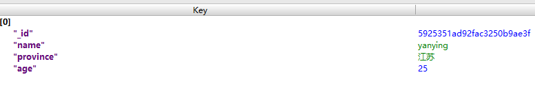

# Python3操作Mongodb简明易懂教程

转载于：[Python3操作Mongodb简明易懂教程](https://segmentfault.com/a/1190000009542534)

Pymongo是Python的一个操作Mongodb的库。

## 连接数据库
链接数据库需要提供一个地址和接口即可。
```python
from pymongo import MongoClient
conn = MongoClient('localhost',27017)
```

当然，你可以使用如下写法：

```python
conn = MongoClient('mongodb://localhost:27017/')
```

## 创建数据库
mongodb不需要提前创建好数据库，而是直接使用，如果发现没有则自动创建。

```python
db = conn.testdb
```

上面的语句，会创建一个`testdb`的数据库。但是，在没有插入数据的时候，该数据库在管理工具里面你是看不到的（不显示）。

## 插入数据
首先第一步我们先插入一条数据瞧瞧。

### 单条记录插入
```python
db.col.insert({"name":'yanying','province':'江苏','age':25})
```

Python控制台什么都没有发生，这就是成功的意思。使用管理工具查看数据库记录，的确包含了一条数据。



### 多条记录插入
Mongodb一次也可以插入多条数据

```python
db.col.insert([
    {"name":'yanying','province':'江苏','age':25},
    {"name":'张三','province':'浙江','age':24},
    {"name":'张三1','province':'浙江1','age':25},
    {"name":'张三2','province':'浙江2','age':26},
    {"name":'张三3','province':'浙江3','age':28},
])
```

## 查询数据
下面我们将刚刚插入的数据查询出来。

### 单条查询
我们可以使用`find_one()`来查询一条记录。

```python
db.col.find_one()
```

上面的语句可以查询出一条mongodb记录。记录中多出来的`_id`是Mongodb自动生成的唯一值。

```python
{'_id': ObjectId('5925351ad92fac3250b9ae3f'), 'name': 'yanying', 'province': '江苏', 'age': 25}
```

### 查询所有
如果我们需要查询出所有的记录，则可以使用`db.col.find()`但是查出来的是一个结果资源集。

我们可以使用for来列出所有记录。

```python
for item in db.col.find():
    print(item)
```

这样可以获取所有记录。

```python
{'_id': ObjectId('5925351ad92fac3250b9ae3f'), 'name': 'yanying', 'province': '江苏', 'age': 25}
{'_id': ObjectId('592550e5d92fac0b8c449f87'), 'name': 'zhangsan', 'province': '北京', 'age': 29}
{'_id': ObjectId('592550f6d92fac3548c20b1a'), 'name': 'lisi', 'province': '上海', 'age': 22}
{'_id': ObjectId('59255118d92fac43dcb1999a'), 'name': '王二麻', 'province': '广东', 'age': 30}
```

### 条件查询
只要将查询条件当做参数塞入即可筛选数据。

```python
for item in db.col.find({'name':"yanying"}):
    print(item)
```

查询结果

```python
{'_id': ObjectId('5925351ad92fac3250b9ae3f'), 'name': 'yanying', 'province': '江苏', 'age': 25}
```

当然还可以查询小于某个值的记录

```python
for item in db.col.find({"age":{"$lt":25}}):
    print(item)
```

或者大于某个值的记录

```python
for item in db.col.find({"age":{"$gt":25}}):
    print(item)
```

### 统计查询
上面的代码可以统计出所有的记录数量

```python
db.col.find().count()
```

或者加点儿条件

```python
db.col.find({"age":{"$gt":25}}).count()
```

### 根据_id查询记录
`_id`是mongodb自动生成的id，其类型为`ObjectId`，想要使用就需要转换类型。

Python3中提供了该方法，不过需要导入一个库。

```python
from bson.objectid import ObjectId
```

这样就可以直接使用`_id`进行查询啦。

```python
collection.find_one({'_id':ObjectId('592550e5d92fac0b8c449f87')})
```

### 结果排序
只要将需要排序的字段放入`sort`方法即可，Mongodb默认为升序

```python
db.col.find().sort("age")
```

不过你也可以加一些参数去改变排序的方式。比如倒序，不过要记得先导入pymongo库

```python
import pymongo
db.col.find().sort("UserName",pymongo.DESCENDING)
```

你还可以让他升序，尽管默认如此

```python
for item in db.col.find().sort('age',pymongo.ASCENDING):
    print(item)
```

## 更新数据
更新数据很简单，只需要一个条件和需要更新的数据即可

```python
db.col.update({'_id':ObjectId('59255118d92fac43dcb1999a')},{'$set':{'name':'王二麻33333'}})
```

结果如下：`王二麻`变成了`王二麻33333`

```python
{'_id': ObjectId('59255118d92fac43dcb1999a'), 'name': '王二麻33333', 'province': '广东', 'age': 30}
```

## 删除数据
删除数据使用`remove()`方法，如果方法带条件，则删除指定条件数据，否则删除全部

删除`name`为`王二麻33333`的用户。

```python
db.col.remove({'name':'王二麻33333'})
```

删除全部数据（慎用）

```python
db.col.remove()
```
