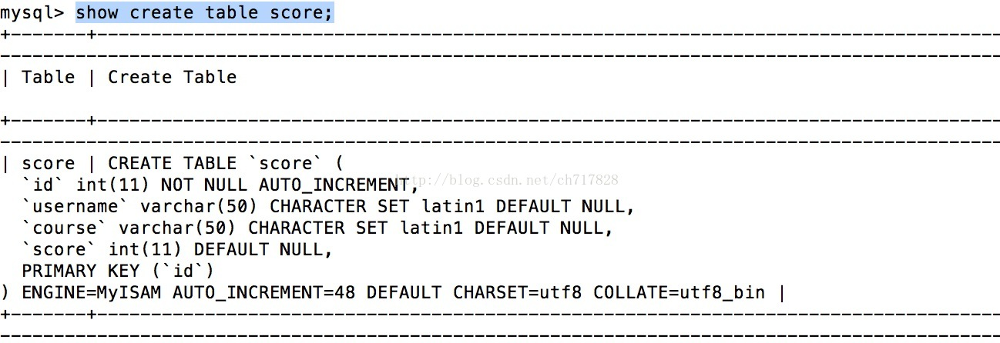
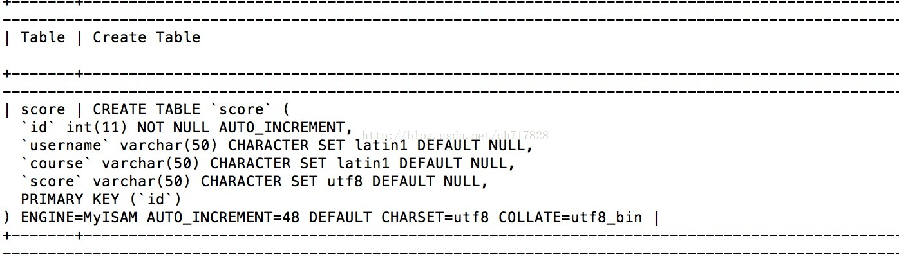
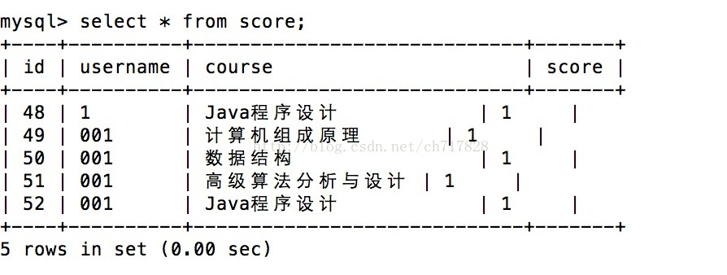

# MySQL 插入中文错误：Incorrect string value_ '_xE7_xA8_x8B_xE5_xBA_x8F...' for column 'course' at row 1

## 错误描述
```
Incorrect string value: '\xE7\xA8\x8B\xE5\xBA\x8F...' for column 'course' at row 1
```

出现这个错误的原因是，数据库的编码格式为`latin1` 而我要将`utf8`的中文插入到数据库中。

## 解决方案

首先修改数据库的编码：

```bash
alter table score default character set utf8;
```

但是插入中文依然出现错误。

然后通过查看数据表编码

```bash
show create table score;
```

发现如下所示


**注意  course 的编码仍然为 `latin1` ，虽然此时表的编码已经是 `utf8 `, 但是不知道为什么 列的编码没有更改过来**

下面就是更改列的编码即可

```bash
 alter table score change course course varchar(50) character set utf8;
```



结果是列的编码已经修改成功

接下来插入`utf8`中文就没有问题了




