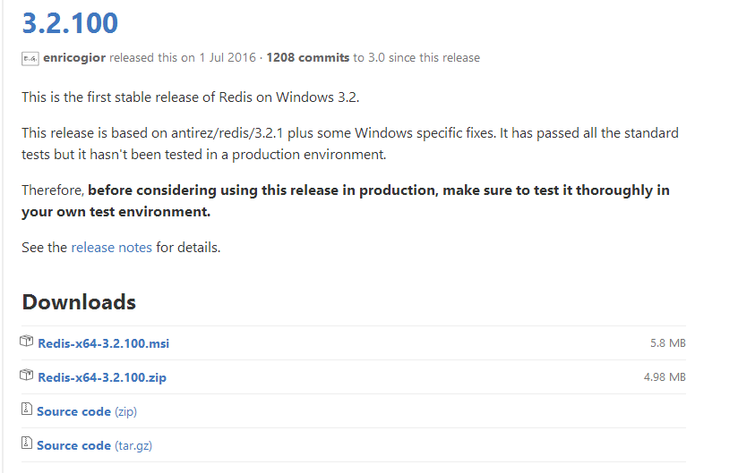
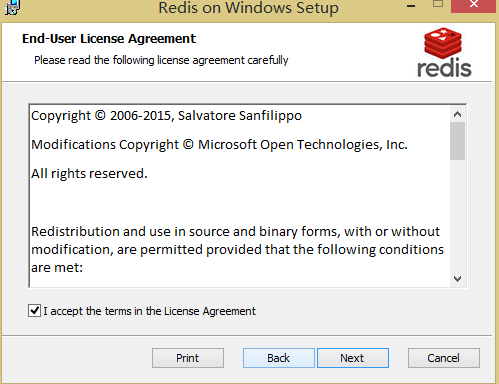
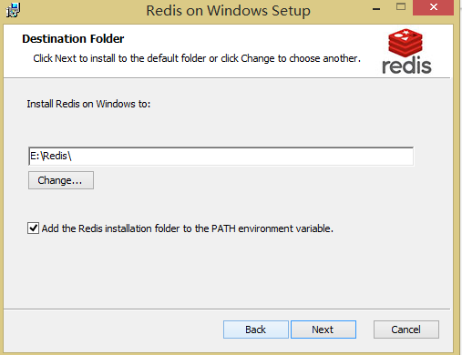
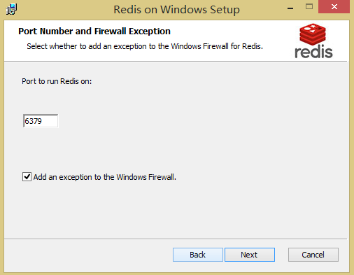
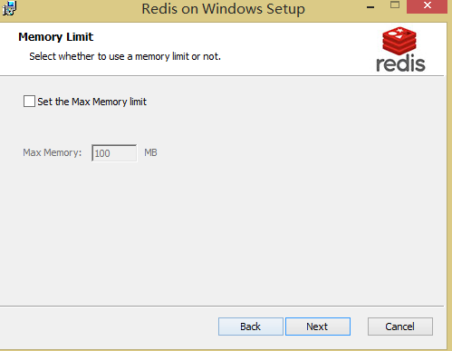
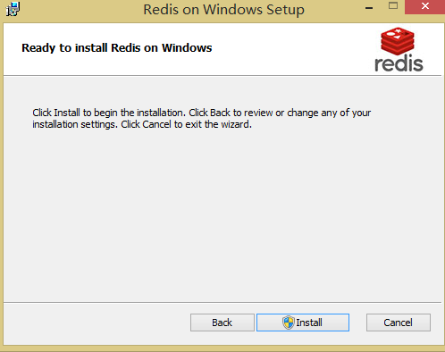
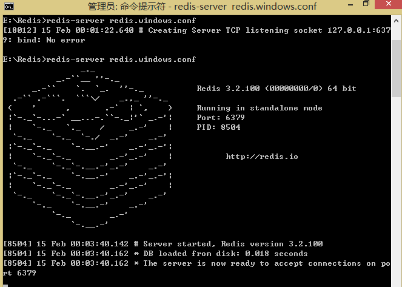
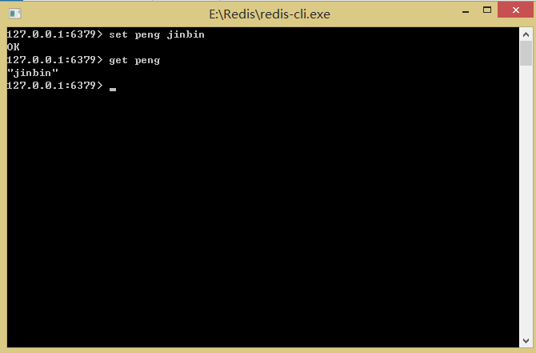

# Windows下安装和配置Redis

## 下载windows版本的Redis

官网上不提供windows版本的，现在官网没有下载地址，只能在github上下载，官网只提供linux版本的下载    

- [官网下载地址](https://redis.io/download)

- [github下载地址](https://github.com/MicrosoftArchive/redis/tags)

这里我选择的是`x64-3.2.100`，下载的时候下载msi(不要下载zip的压缩包)

建议：在github上公开项目下载速度非常慢，我100M光钎每秒速度不到10K


## 安装Redis

1.首先双击现在完的安装程序

2.点击next

3.点击接受，继续next，选择安装的路径，**并且打上勾（这个非常重要），添加到path是把Redis设置成windows下的服务**，不然你每次都要在该目录下启动命令`redis-server redis.windows.conf`，但是只要一关闭cmd窗口，redis就会消失，这样就比较麻烦。

4.设置Redis的服务端口，默认为6379，默认就好，单击next

5.设置Max Memory，然后next进入安装

如果redis的应用场景是作为db使用，那不要设置这个选项，因为db是不能容忍丢失数据的。

如果作为cache缓存那就得看自己的需要（我这里设置了1024M的最大内存限制）

指定Redis最大内存限制，Redis在启动时会把数据加载到内存中，达到最大内存后，Redis会先尝试清除已到期或即将到期的Key，当此方法处理 后，仍然到达最大内存设置，将无法再进行写入操作，但仍然可以进行读取操作。Redis新的vm机制，会把Key存放内存，Value会存放在swap区。

6.安装完成

## 测试所安装的Redis

如果你是和我一样通过msi文件的安装，你可以在`计算机管理→服务与应用程序→服务`看到Redis正在运行。

你也可以将它停止，(不停止会出现错误代码为18012的错误，表示本机端口6379被占用)

然后在cmd窗口进入Redis的安装路径的根目录  

**输入命令`redis-server.exe redis.windows.conf`，出现下图证明Redis服务启动成功**

下面进行测试：

你可以在Redis的安装根目录下找到`redis-cli.exe`文件启动(我用的是这种方法)

或在cmd中先进入Redis的安装根目录用命令**`redis-cli.exe -h 192.168.10.61 -p 6379`（注意换成自己的IP）**的方式打开

测试方法：`设置键值对`、`取出键值对`，（我这里键值对是peng）

测试成功，安装完成。

