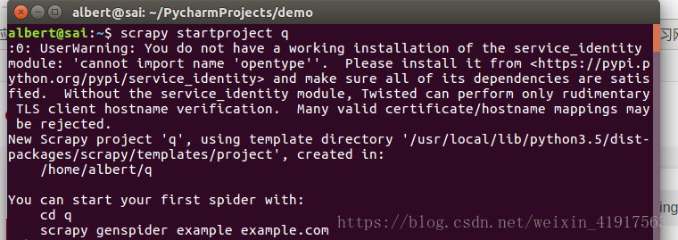
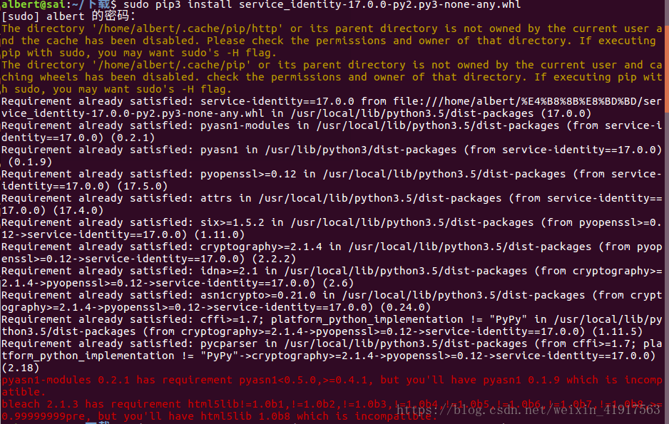

# Scrapy时遇到：UserWarning_ You do not have a working installation of the service_identity module

## 问题

```
UserWarning: You do not have a working installation of the service_identity module: 'cannot import name 'opentype''.  Please install it from <https://pypi.python.org/pypi/service_identity> and make sure all of its dependencies are satisfied.  Without the service_identity module, Twisted can perform only rudimentary TLS client hostname verification.  Many valid certificate/hostname mappings may be rejected.
```




## 分析问题
分析问题原因：

```
Please install it from <https://pypi.python.org/pypi/service_identity> and make sure all of its dependencies are satisfied.  
```

故需要在网站下载`service_identity`的whl组件：[https://pypi.python.org/pypi/service_identity](https://pypi.python.org/pypi/service_identity)


接下来进行安装：

```bash
sudo pip3 install service_identity-17.0.0-py2.py3-none-any.whl
```

又出现还未解决的一些问题：



针对这个问题，主要是一些安装包的版本不一致导致的，可直接强制更新，输入以下命令：

```bash
sudo pip3 install service_identity --force --upgrade
```


